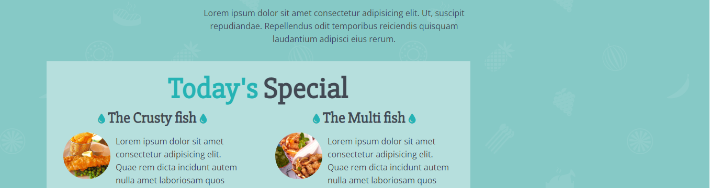

# TP FINAL JS 24

- Basé sur l'exercice Fish and Chips vu dans le module HTML/CSS, créer et injecter entièrement la section `Today's Special` en JS

- Le fichier HTML est fourni ainsi que le fichier CSS, concentrez vous sur le JS.
- il faut en plus rajouter 2 boutons qui vont afficher ou cacher respectivement la section et le aside

- code propre, PAS d'injection de balises en innerHTML par exemple

- le contenu devra être injecter via l'objet datas 

## maquettes

- quand tout est affiché

- uniquement le aside

- uniquement la section

